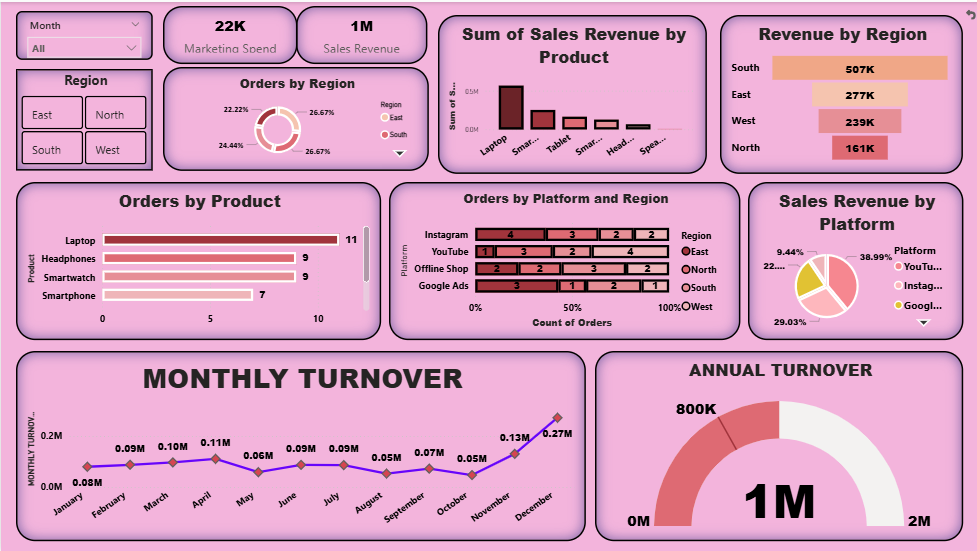

Sales Performance Dashboard — Power BI

A comprehensive interactive sales dashboard built in **Power BI** to analyze revenue, orders, and marketing performance across regions, products, and platforms.

---

Dashboard Preview

---

Key Metrics

| Metric | Value |
|---|---|
| 💰 Total Sales Revenue | **1M** |
| 📣 Marketing Spend | **22K** |
| 📦 Top Product by Orders | **Laptop (11 orders)** |
| 🌍 Top Region by Revenue | **South (507K)** |
| 📅 Peak Month | **December (0.27M)** |

---

Dashboard Sections

1. Revenue by Region
- **South** leads with **507K**
- Followed by East (277K), West (239K), North (161K)

2. Orders by Product
- Laptop: 11 | Headphones: 9 | Smartwatch: 9 | Smartphone: 7

3. Orders by Platform & Region
- Platforms tracked: Instagram, YouTube, Offline Shop, Google Ads
- Cross-regional breakdown per platform

4. Sales Revenue by Platform
- YouTube: **38.99%** (top platform)
- Offline Shop: **29.03%**
- Instagram: **22%**
- Google Ads: **9.44%**

5. Monthly Turnover Trend
- Consistent performance Jan–Sep (~0.05M–0.11M)
- Sharp growth spike in **Nov–Dec** reaching **0.27M**

6. Annual Turnover Gauge
- Total Annual Revenue: **1M** out of a 2M target

---

Tools Used

- **Power BI Desktop** — Dashboard creation & visualization
- **DAX** — Calculated measures and KPIs
- **Excel / CSV** — Data source

---

How to Use

1. Clone or download this repository
2. Open the `.pbix` file in **Power BI Desktop**
3. Use the slicers (Month, Region) to filter and explore the data
4. Publish to Power BI Service for sharing online

---

 Author

**Sri Vishnupriya**
- BSC Computer Science with Data Science
- [LinkedIn](https://www.linkedin.com/in/sri-vishnupriya-a-8aa061398/) | [GitHub](https://github.com/Ammu0010/)

